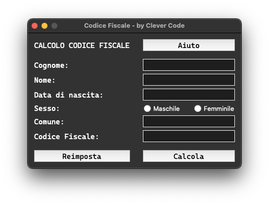

# tax-code

Simple UI, GUI and Telegram Bot that make Tax Code.

## mini docs

I have created 3 different ways for you to use my project, let's see them together and feel free to use whichever one you prefer!

### CLI / Hacker version

The CLI (Command Line Interface) or Hacker version allows you to use my project from the command line using our best friend: the terminal! To use this version, you will not have to install any libraries, and just use the following command to generate a tax code:

```
python cli.py
```

This version in my opinion is very clean and easy to use! I am already thinking of some changes to add to make the command-line user experience even simpler and cleaner. For example in the future I might use the `argparse` library to enter from the command line parameters such as last name, first name, ect... Let me know what you think!

### GUI version

The GUI (Graphical User Interface) version is intended for anyone who likes to use desktop programs that enhance the user experience because they are much easier to use.
Again, to use my project, you don't have to install any external libraries and just use the following command to generate as many tax codes as you want:

```
python gui.py
```

Also for this version in the future I may add a `Makefile` to generate an executable that can be distributed among various operating systems, and I was also thinking about modifying the design a little bit because it is currently very basic. Let me know what you think! To give you an idea of what I am talking about, let me show you a preview of the GUI version:

<p align="center">
    
</p>

### Bot version

Finally we have the version associated with a telegram bot. This version is dedicated to all those who are always with their smartphone in hand, in fact, thanks to the telegram bot it will be possible to always have at hand my project that will allow you to calculate the tax code of anyone you want! In this case, however, you will have to install the `pyTelegramBotAPI` external library using the command `pip install -r requirements.txt`. I leave it up to you whether or not to create a virtual environment for this project, although I highly recommend it! (I remind you that just use the following commands and you are done: `virtualenv venv` and `source venv/bin/activate`). Now to run the program you can use the following command:

```
python bot.py
```

> [!NOTE]
> To use a telegram bot you will have to create one by interacting with `@BotFather` to get your API token and save it in `assets/bot_db.json`!

For the telegram bot I am considering putting it online on some hosting service and making it public, let me know if you might be interested so I can save you from all that I described at the beginning!

In conclusion, I would like to inform you that all the tax codes that will be generated will be saved at the following path: `assets/db_it.json`.